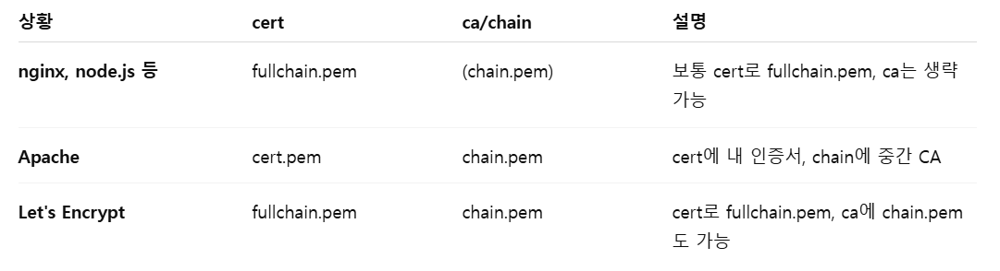

# Noom

Zoom Clone using NodeJS, WebRTC and Websockets

- ws라이브러리를 이용한 채팅 <br>
https://velog.io/@merci/nodejs-wss
- socketIO를 이용한 채팅 <br>
https://velog.io/@merci/Socket-I.O
- WebRTC를 이용한 영상회의 <br>
https://velog.io/@merci/MediaStream-API-WebRTC

## npm 초기화

- 목적: 프로젝트의 종속성(Dependencies)과 메타데이터를 관리</br>

`npm init -y` 명령을 실행하면 `package.json`이 생성된다

`npm init` 이후 `npm`으로 설치하는 패키지들은 자동으로 `package.json`에 등록된다

이후 다른 PC에서 `npm i` 명령을 실행하면 `package.json`을 참조하여 `node_modules` 폴더에 패키지가 설치된다

### Nodemon
변경을 감지했을 때 Node.js 애플리케이션을 자동으로 다시 시작해주는 도구
- 설치

프로젝트에만 설치
```
npm install --save-dev nodemon
```
--save-dev 옵션을 사용하여 개발 의존성(devDependencies) 으로 추가

- 실행방법

  `node app.js` 대신 아래 명령어로 서버를 시작시킬 수 있다
```
nodemon app.js
```
또는 `package.json` 에 아래 부분 추가하여 
```
{
  "scripts": {
    "start": "node app.js",
    "dev": "nodemon app.js"
  }
}
```
`npm run dev` 명령어로 실행하면 `npm run nodemon app.js`
- 추가 설정

특정 파일 확장자 감지
```
nodemon --ext js,json
```
.`js`나 `.json` 파일이 변경될 때만 다시 시작한다

또는 실행 파일을 지정하는 방법

`nodemon.json`파일을 만들고 아래 부분을 추가 변경을 감지하면 자동 재시작한다
```
{
  "watch": ["server", "config"],
  "ext": "js,json",
  "ignore": ["node_modules"],
  "exec": "node server.js"
}
```
watch: 감시할 디렉토리 지정

ext: 감시할 파일 확장자 지정

ignore: 특정 폴더 무시

exec: 실행할 명령어 지정

### nodemon 의 실행 순서 (우선순위)
1️⃣ 명령어에서 직접 파일 지정 → `nodemon server.js` → server.js 실행

2️⃣ `nodemon.json`에 `exec` 설정이 있는 경우 → 해당 명령 실행
```json
{
  "exec": "babel-node src/server.js"
}
```

3️⃣ `package.json`의 `main` 속성이 있는 경우 → 해당 파일 실행
```json
{
  "main": "app.js"
}
```

4️⃣ `package.json`의 `scripts.dev` 속성이 있는 경우
```json
{
  "scripts": {
    "dev": "nodemon server.js"
  }
}
```

5️⃣ 위의 모든 설정이 없으면 `index.js` 실행

`index.js`도 없으면 오류 발생

📌 최종 실행 결과

✅ `npm run dev` 실행

✅ `nodemon server.js` 실행 (하지만 `nodemon.json`을 읽음)

✅ `nodemon.json`의 `exec` 설정에 의해 `babel-node src/server.js` 실행

 최종 실행되는 명령어는 `babel-node src/server.js`
 
## chain 인증서 
